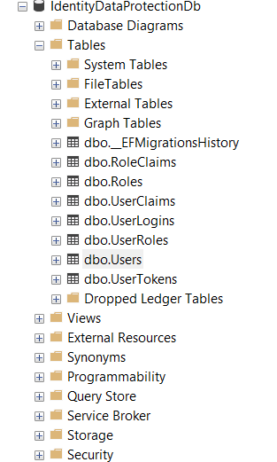
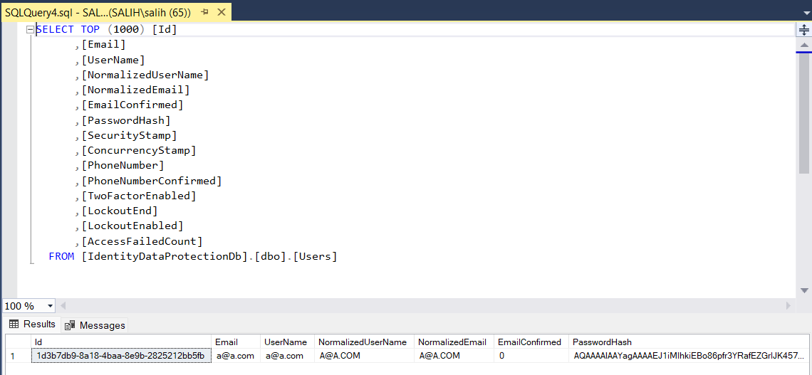

# Identity ve Veri Koruma Projesi

Bu proje, ASP.NET Core Identity kullanılarak geliştirilmiş bir kimlik doğrulama ve yetkilendirme uygulamasıdır. Kullanıcı yönetimi, rol tabanlı yetkilendirme ve veri koruma özelliklerini içermektedir.

## Özellikler

- Kullanıcı kaydı ve girişi
- Email ve telefon numarası doğrulama
- İki faktörlü kimlik doğrulama (2FA)
- Rol tabanlı yetkilendirme
- Güvenli parola yönetimi
- Kullanıcı kilitleme ve güvenlik damgası
- Normalize edilmiş kullanıcı verileri

## Teknolojiler

- ASP.NET Core 7.0+
- Entity Framework Core
- Microsoft Identity
- SQL Server
- JWT Authentication

## Proje Yapısı

- `Controllers/`: API endpoint'lerini içerir
- `Models/`: Veri modelleri ve DTO'lar
- `Contexts/`: Veritabanı bağlam sınıfları
- `DTOs/`: Veri transfer nesneleri

## Veritabanı Tabloları

- Users: Kullanıcı bilgileri
- Roles: Sistem rolleri
- UserRoles: Kullanıcı-rol ilişkileri
- UserClaims: Kullanıcı yetki iddiaları
- RoleClaims: Rol yetki iddiaları
- UserLogins: Harici giriş bilgileri
- UserTokens: Kullanıcı tokenleri

## Veritabanı Yapısı

### Veritabanı Diyagramı



### Users Tablosu Yapısı



### Ana Tablolar

- `dbo.Users`: Kullanıcı ana bilgileri (Id, Email, UserName, PasswordHash, SecurityStamp vb.)

## Kurulum

1. Projeyi klonlayın:

```bash
git clone [proje-url]
```

2. Gerekli NuGet paketlerini yükleyin:

```bash
dotnet restore
```

3. Veritabanını oluşturun:

```bash
dotnet ef database update
```

4. `appsettings.json` dosyasını düzenleyin:

- Veritabanı bağlantı dizesini ayarlayın
- JWT ayarlarını yapılandırın
- Email servis ayarlarını yapın

5. Projeyi çalıştırın:

```bash
dotnet run
```

## API Endpoints

API Base URL: `http://localhost:5012/scalar/v1`

- POST /api/register: Yeni kullanıcı kaydı
- POST /api/login: Kullanıcı girişi
- GET /api/user: Kullanıcı bilgilerini getirme
- PUT /api/user: Kullanıcı bilgilerini güncelleme
- POST /api/logout: Çıkış yapma

## Güvenlik Özellikleri

- Parola hash'leme
- Email doğrulama
- Telefon doğrulama
- Güvenlik damgası
- Eşzamanlılık kontrolü
- Hesap kilitleme
- Başarısız giriş denemesi sayacı

## Geliştirme Ortamı Gereksinimleri

- .NET 7.0 SDK veya üzeri
- SQL Server
- Visual Studio 2022 veya VS Code
