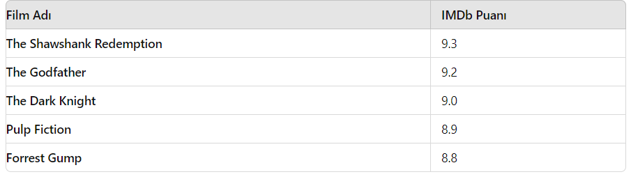

# Pratik - IMDB Listesi

Aşağıda belirtilen adımları gerçekleştirerek bir Imdb - Film Listesi oluşturuyoruz.

    - Sinema Filmlerini listeleyeceğimiz bir liste oluşturalım.

    - Film için propertyler -> Imdb Puanı (Double) - İsmi

    - Kullanıcıdan sınırsız sayıda film adı ve imdb puanı isteyip bu bilgilerle nesneler oluşturulup liste doldurulacak.

    - Kullanıcıya her film eklemesinden sonra yeni bir film eklemek isteyip istemediği sorulsun. Kullanıcı evet cevabını verirse döngüde başa dönülerek yeni bir film oluşturulup ilgili listeye aktarılsın. Hayır cevabı verilirse program aşağıdaki çıktıları ayrı ayrı sunarak sonlandırılsın.

Uygulamanın sonunda

    1. Bütün filmler listelensin.

    2. Imdb puanı 4 ile 9 arasında olan bütün filmler listelensin.

    3. İsmi 'A' ile başlayan filmler ve imdb puanları listelensin.
