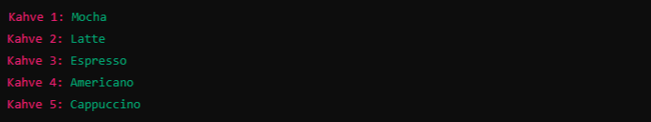
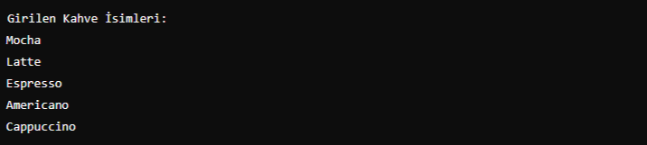

# Pratik - Lists 2

Bir kahve içsek bize iyi gelecek!

kullanıcının konsoldan gireceği 5 kahve ismiyle bir liste oluşturup, bu listeyi foreach döngüsüyle yazdıralım.

Örnek veri giriş ekranı :

Örnek Program Çıktısı:

