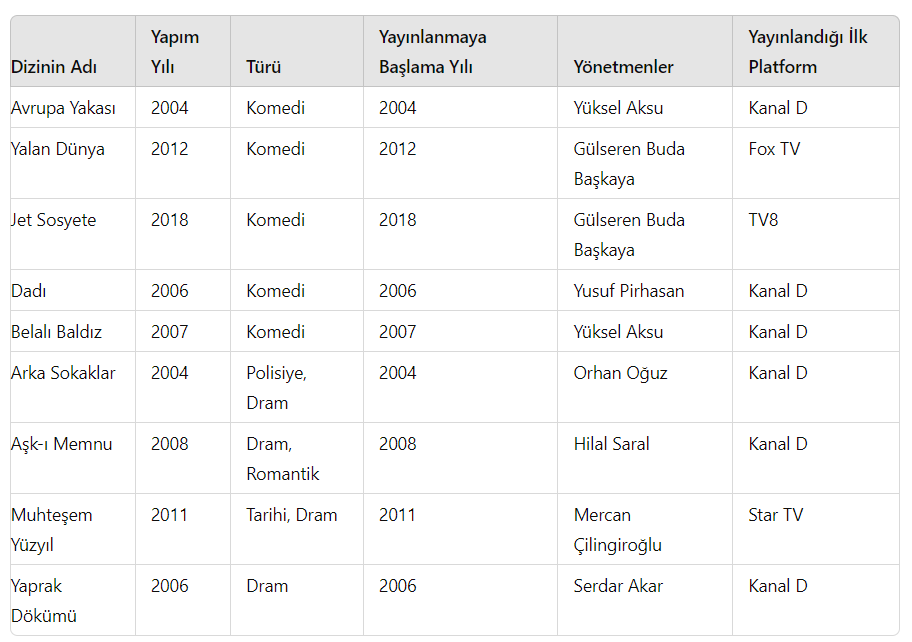

# Pratik - Patikaflix Diziler Platformu

Bu pratikte sizlerden bir Diziler listesi oluşturmanız ve içerisindeki nesneleri tanımlamanız bekleniyor. Elemanların oluşturuluşu Console ekranı üzerinden olacak.

Yani kullanıcıya her diziyi oluşturup listeye ekledikten sonra yeni bir dizi ekleyip eklemediğini sormamız gerekiyor.

Örnek Veriler

Ardından aşağıda istenilen işlemleri gerçekleştiriniz.

- İlk listenizde bulunan komedi dizilerinden yeni bir liste oluşturunuz. Bu listede yalnızca Dizi Adı / Dizi Türü / Yönetmen bilgileri yer alsın (Yani başka bir class ihtiyacınız doğuyor.)
- Bu yeni listenin bütün elemanlarını bütün özellikleriyle ekrana yazdırınız. Yazımın öncelikle dizi isimleri sonra da yönetmen isimleri baz alınarak sıralanmasına özen gösteriniz.
