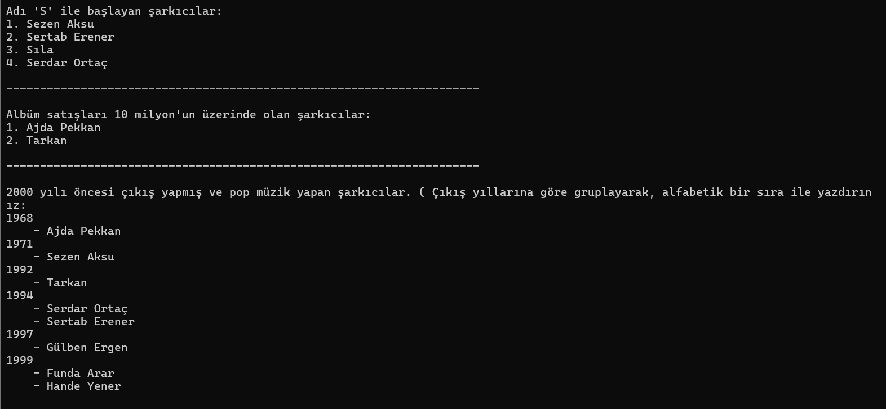
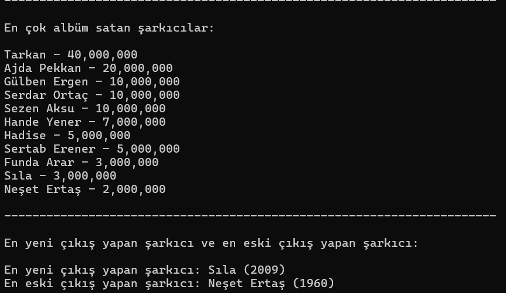

# Patikafy Müzik Platformu

Bu proje, Türk müzik endüstrisindeki önemli sanatçıların bilgilerini içeren ve çeşitli sorgulama özellikleri sunan bir konsol uygulamasıdır.

## Özellikler

Uygulama aşağıdaki özellikleri sunmaktadır:

1. Adı 'S' ile başlayan şarkıcıları listeleme
2. Albüm satışları 10 milyonun üzerinde olan sanatçıları görüntüleme
3. 2000 yılı öncesi çıkış yapmış ve pop müzik yapan şarkıcıları, çıkış yıllarına göre gruplayarak alfabetik sıralama
4. En çok albüm satan şarkıcıları listeleme
5. En yeni ve en eski çıkış yapan sanatçıları gösterme

## Teknolojiler

- .NET 8.0
- C#
- LINQ

## Proje Yapısı

Proje iki ana sınıftan oluşmaktadır:

- `Singer.cs`: Sanatçı bilgilerini tutan model sınıfı
- `Program.cs`: Ana uygulama mantığını içeren sınıf

## Veri Yapısı

Sanatçı bilgileri aşağıdaki özellikleri içermektedir:

- ID (Guid)
- İsim
- Müzik Türü
- Çıkış Yılı
- Albüm Satışları

## Örnek Çıktılar

## Kurulum

1. Projeyi klonlayın
2. Visual Studio veya tercih ettiğiniz IDE'de açın
3. Projeyi derleyin ve çalıştırın

## Lisans

Bu proje eğitim amaçlı oluşturulmuştur.
