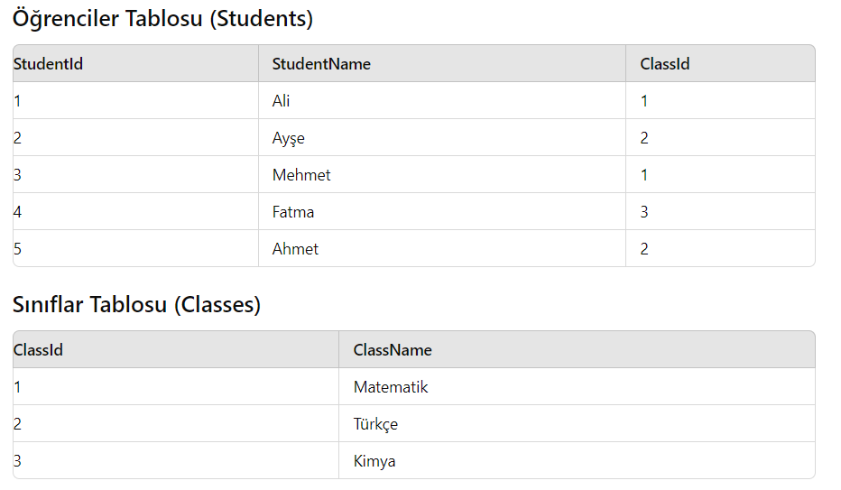

# Pratik - Linq Group Join

Bir okul veritabanı oluşturuyorsunuz ve aşağıdaki iki tablonun verilerini kullanarak group join işlemi gerçekleştirmeniz gerekiyor:

Öğrenciler Tablosu (Students):

- StudentId: Öğrencinin benzersiz kimliği
- StudentName: Öğrencinin adı
- ClassId: Öğrencinin ait olduğu sınıfın kimliği

Sınıflar Tablosu (Classes)

- ClassId: Sınıfın benzersiz kimliği
- ClassName: Sınıfın adı

Aşağıdaki görevleri yerine getirin:

1. Tabloyu Tanımlayın:

   - Student ve Class isimli iki sınıf oluşturun. Her bir sınıf için uygun veri türlerini kullanarak C# sınıflarını tanımlayın.

2. Veri Listelemesi:

   

3. LINQ Sorgusu:

   - Öğrenciler ve sınıflar arasında group join işlemi yaparak, her sınıfın altında o sınıfa ait olan öğrencilerin listelendiği bir sonuç elde edin. Sonuçları sınıf adıyla birlikte, o sınıfa ait öğrencilerin isimleriyle birlikte ekrana yazdıran bir LINQ sorgusu yazın.
