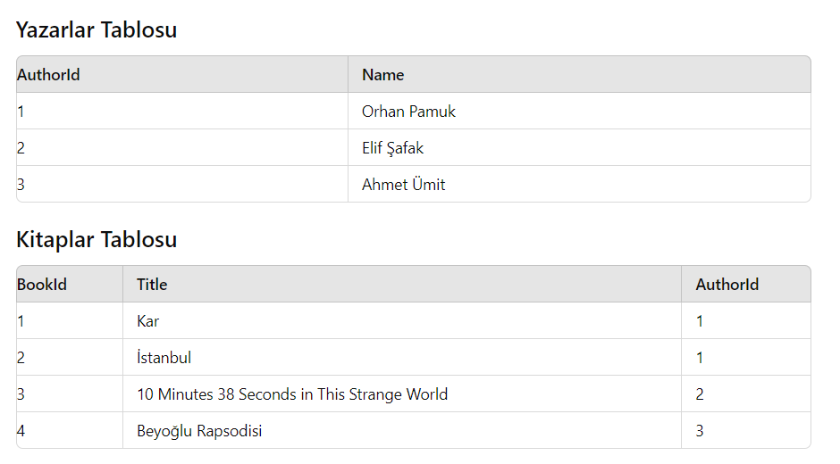

# Pratik - Linq Join

Bir kütüphane yönetim sistemi oluşturun. Bu sistemde iki adet tablo bulunmaktadır: Yazarlar ve Kitaplar. Aşağıda her iki tablonun yapısı verilmiştir:

1. Yazarlar Tablosu (Authors)

   - AuthorId (int) - Yazarın benzersiz kimliği
   - Name (string) - Yazarın adı

2. Kitaplar Tablosu (Books)
   - BookId (int) - Kitabın benzersiz kimliği
   - Title (string) - Kitabın başlığı
   - AuthorId (int) - Kitabın yazarının kimliği (Yazarlar tablosundaki AuthorId ile ilişkilidir)

Görev:

1. Tabloları Tanımlayın:

   - Author ve Book adında iki sınıf oluşturun ve yukarıdaki tablo yapılarını bu sınıflara uygun şekilde tanımlayın.

2. Verileri Ekleyin:

   - Her iki tabloya da örnek veriler ekleyin. En az 3 yazar ve 4 kitap ekleyin.

3. LINQ Sorgusu Yazın:

   - Kitapları ve yazarları birleştiren bir LINQ sorgusu oluşturun. Bu sorgu, her kitabın başlığını ve yazarının adını içermelidir.

4. Sonuçları Yazdırın:

   - Oluşturduğunuz LINQ sorgusunun sonucunu ekrana yazdırın. Her kitabın başlığı ve yazarının adını içeren bilgileri göstermelisiniz.

Örnek Veriler:

Notlar:

- LINQ sorgusunda join işlemini kullanarak iki tabloyu birleştirin.
- Sonuçları ekrana yazdırırken kitap başlığını ve yazarın adını göstermek için uygun bir format kullanın.
